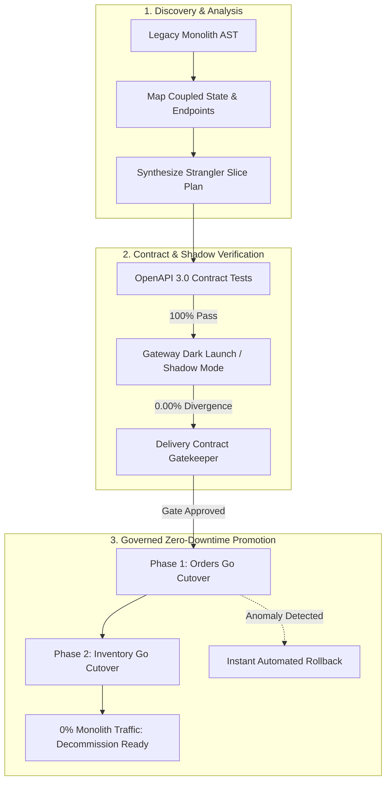
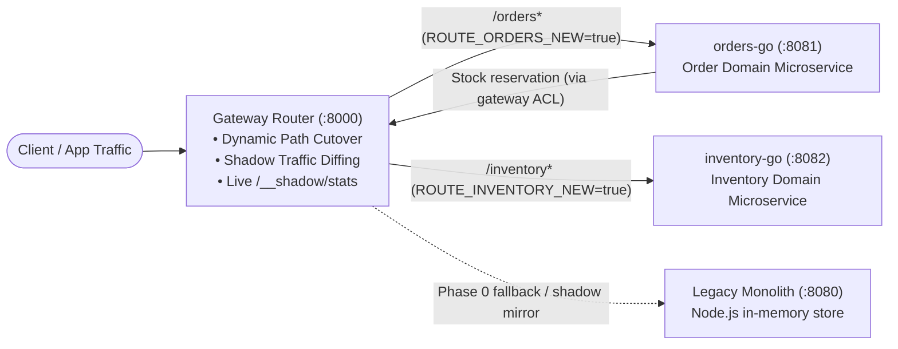

# strangler-lab: Agentic Legacy Modernization Platform

**Agentic Strangler Fig Platform** — safely decompose legacy monoliths into high-performance Go microservices with autonomous agent verification, dual-domain contract testing, shadow traffic diffing, and zero-downtime cutover gates.

> Production-grade architecture lab demonstrating modern **Agentic Modernization** patterns used to migrate mission-critical retail systems (Monolith → Distributed Go Services).  
> **Clean-room educational architecture.** Author: [Aniket Singh](https://github.com/acephos) · MIT License

[](https://github.com/acephos/strangler-lab/actions)
[](https://go.dev/)
[](https://nodejs.org/)
[](contracts/openapi.yaml)
[](LICENSE)

---

## ⚡ 60-Second Live Demo

Run the end-to-end agentic modernization lifecycle with a single command:

```bash
git clone https://github.com/acephos/strangler-lab.git
cd strangler-lab
make demo    # or: npm run demo
```

**What the autonomous harness executes live on your machine:**
1. 🔍 **Monolith AST Analysis**: Parses legacy code, maps tightly coupled state stores, and designs a sliced migration plan.
2. 📋 **Dual-Domain Contract Parity**: Verifies 100% test pass rate across OpenAPI 3.0 specs for both Orders and Inventory.
3. 👥 **Dark Launch & Shadow Mirroring**: Mirrors live traffic through the gateway to compare candidate Go responses against Legacy with 0.00% drift.
4. 🛡️ **Delivery Contract Gate**: Enforces formal acceptance policy before authorizing live routing.
5. 🔀 **Phase 1 Slice Cutover**: Dynamically routes Orders to `orders-go`, reserving stock via an Anti-Corruption Layer (ACL).
6. 🚀 **Phase 2 Full Cutover**: Dynamically routes Inventory to `inventory-go` — **0% legacy monolith traffic**.
7. 🔄 **Automated Rollback Drill**: Simulates canary anomaly and executes sub-second rollback to legacy baseline without dropping traffic.
8. 📊 **Audit Ledger**: Generates a tamper-evident audit record (`migration-ledger.json`) and executive scorecard (`MIGRATION_SCORECARD.md`).

---

## The Modernization Problem & The Agentic Solution

### The Challenge of Legacy Modernization
Enterprise backends often start as a single monolith owning orders, inventory, billing, and pricing. Over time, these domains become entangled through shared database state and in-process function calls. 
- **Big-bang rewrites almost always fail**: Freezing business development for months while re-architecting creates catastrophic release risk.
- **Manual strangler migrations are slow and error-prone**: Teams struggle with subtle schema drift, unmapped implicit dependencies, and fear of cutting over production traffic.

### The Agentic Modernization Approach
Instead of manual, high-risk rewrites, **Agentic Modernization** pairs autonomous verification agents with deterministic safety gates:
- **Agentic Decomposition**: AI and AST analysis map dependencies and extract clean API boundaries.
- **Contract-Guarded Extraction**: Strict schema enforcement ensures the candidate service matches the legacy interface before a single user request is cut over.
- **Shadow Traffic Divergence Auditing**: Edge proxy mirrors real traffic to compare response status, JSON schemas, and latencies in real time.
- **Policy-Based Delivery Contracts**: Automated gates verify zero drift, test compliance, and latency SLAs before issuing cryptographic cutover approval.

---

## Architecture

### 1. The Agentic Modernization Lifecycle



### 2. Live Runtime Edge Routing



---

## Modernization Phases & Port Mapping

| Service | Port | Technology | Migration Role |
| :--- | :---: | :--- | :--- |
| **`gateway`** | `8000` | Go (std `net/http`) | Edge proxy, dynamic cutover router (`/__admin/cutover`), shadow diffing engine |
| **`legacy`** | `8080` | Node.js | Monolith: orders + inventory in one process with shared state |
| **`orders-go`** | `8081` | Go 1.22 | Extracted order service; delegates stock reservation via gateway ACL |
| **`inventory-go`** | `8082` | Go 1.22 | Extracted inventory service; replaces legacy stock management |

---

## Cutover Playbook (Step-by-Step)

```
Phase 0 (Baseline)     Phase 1 (Partial Slice)     Phase 2 (Full Cutover)
┌─────────────┐        ┌─────────────┐             ┌─────────────┐
│   Gateway   │        │   Gateway   │             │   Gateway   │
└──────┬──────┘        └──┬───────┬──┘             └──┬───────┬──┘
       │                  │       │                   │       │
       ▼                  ▼       ▼                   ▼       ▼
┌─────────────┐      ┌─────────┐ ┌─────────┐     ┌─────────┐ ┌────────────┐
│ Legacy Mono │      │orders-go│ │ Legacy  │     │orders-go│ │inventory-go│
│ (Orders +   │      │(Orders) │ │  (Inv)  │     │(Orders) │ │   (Inv)    │
│  Inventory) │      └────┬────┘ └─────────┘     └────┬────┘ └────────────┘
└─────────────┘           └───────────▲               └────────────▲
                          (ACL Reserve)               (Direct Reserve)
```

1. **Phase 0 — Legacy Baseline**: 100% of traffic directed to the Node.js monolith (`ordersNew: false, inventoryNew: false`).
2. **Phase 1 — Orders Slice**: `orders-go` handles `/orders*`. Stock reservations route back through the gateway into the legacy inventory store.
3. **Phase 2 — Full Cutover**: `inventory-go` activated (`inventoryNew: true`). Both `/orders` and `/inventory` are served by Go microservices with **0 calls to legacy**.
4. **Phase 3 — Monolith Decommission**: Safe decommission once the persistent audit ledger confirms steady-state production operation.

---

## Observability & Response Headers

Every response passing through the gateway includes headers proving architectural provenance:

- `X-Served-By`: `orders-go`, `inventory-go`, `legacy-monolith`, or `gateway`
- `X-Gateway-Target`: Upstream base URL selected by the router (e.g., `http://127.0.0.1:8081`)
- `X-Shadow-Tested`: Indicates request was mirrored and validated against candidate backend

Inspect routing and shadow statistics dynamically:

```bash
# Query active routing flags and targets
curl -s http://127.0.0.1:8000/__routes | jq .

# Query live shadow divergence statistics
curl -s http://127.0.0.1:8000/__shadow/stats | jq .

# Query system health and request metrics
curl -s http://127.0.0.1:8000/health | jq .
```

---

## Repository Layout

```
.
├── agent/                   # Agentic modernization harness
│   ├── analyzer.js          # Monolith AST & dependency discovery
│   ├── verifier.js          # Dual-domain contract verification runner
│   ├── shadow-auditor.js    # Shadow traffic & latency divergence auditor
│   ├── gatekeeper.js        # Policy-based delivery contract & cutover gate
│   ├── ledger.js            # Immutable audit trail & scorecard generator
│   └── demo.js              # 60-second end-to-end interactive demo
├── contracts/               # Contract-first specifications
│   ├── openapi.yaml         # OpenAPI 3.0.3 specification (Orders + Inventory)
│   └── contract.test.js     # 24 contract tests against Legacy vs Go services
├── gateway/                 # Edge cutover router & shadow engine (Go)
│   └── main.go              # Dynamic cutover, mirroring, and stats endpoints
├── legacy/                  # Legacy retail monolith (Node.js)
│   └── server.js            # Monolith orders + inventory with in-memory state
├── services/
│   ├── orders-go/           # Go orders microservice (Slice 1)
│   └── inventory-go/        # Go inventory microservice (Slice 2)
├── scripts/
│   ├── dev-up.js            # Local multi-service development orchestrator
│   └── smoke.js             # Multi-phase E2E smoke & rollback test suite
├── .github/workflows/
│   └── ci.yml               # GitHub Actions CI matrix
├── MIGRATION_SCORECARD.md   # Auto-generated executive modernization scorecard
├── migration-ledger.json    # Cryptographic audit ledger
├── Makefile                 # Developer targets
└── docker-compose.yml       # Containerized multi-service deployment
```

---

## Developer Workflow & Commands

| Command | Action |
| :--- | :--- |
| `make demo` | Run the complete automated agentic modernization demo |
| `make test` | Run all contract tests and multi-phase smoke suites |
| `make contract` | Run the 24 OpenAPI contract tests (`npm test` in `contracts/`) |
| `make smoke` | Run the multi-phase smoke and rollback validation suite |
| `make up` | Start the full live stack in foreground (`:8000`, `:8080`, `:8081`, `:8082`) |
| `make build` | Compile all Go microservice binaries |
| `make tidy` | Clean and verify Go modules |
| `make fmt` | Format Go codebase with `gofmt` |

---

## Real-World Modernization Competencies Showcased

1. **Agentic Modernization & AST Analysis**: Autonomous discovery of coupled monolith domains, route maps, and dependency graphs.
2. **Contract-First Safety**: OpenAPI 3.0 contracts tested on both old and new implementations before traffic cutover.
3. **Dual-Run / Shadow Traffic Mirroring**: Zero-risk candidate validation via edge proxy diffing with real-time divergence counters.
4. **Anti-Corruption Layer (ACL)**: Intermediate phase where modern services interact with legacy stores without polluting new service boundaries.
5. **Dynamic Zero-Downtime Cutover**: Hot routing updates and instantaneous incident rollback without dropping connections or redeploying.
6. **Regulatory-Grade Auditability**: Cryptographically hashed migration ledger (`migration-ledger.json`) tracking every gate decision and cutover timestamp.

---

## License

MIT © [Aniket Singh](https://github.com/acephos) — see [LICENSE](LICENSE).
